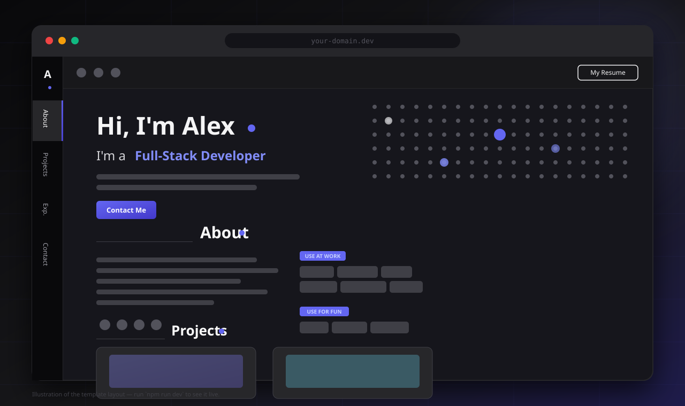

# Developer Portfolio Template

A dark, animated developer portfolio inspired by the [Steam template](https://www.hover.dev/templates/demo/steam) from Hover.dev, rebuilt as a **reusable template**. Every word, project, skill and link lives in one config file — edit `src/config/portfolio.ts`, drop in your own images, deploy.

[](LICENSE)
[](https://react.dev)
[](https://www.typescriptlang.org)
[](https://vite.dev)
[](https://tailwindcss.com)

<p align="center">
  <a href="https://github.com/your-username/steam-portfolio-template"></a>
  <a href="https://github.com/your-username/steam-portfolio-template/generate"></a>
</p>

> **Before you publish:** every value in `src/config/portfolio.ts` is example
> content (the name "Alex Morgan", four demo projects, a bio, three jobs). The
> blue strip at the top of the page reminds you until you dismiss it — then set
> `site.showExampleBanner` to `false`.

---

## 📸 Preview



<sub>Vector illustration of the layout (not a screenshot) — run <code>npm run dev</code> to see it live.</sub>

| Section            | What it does                                                              |
| ------------------ | ------------------------------------------------------------------------- |
| **Hero**           | Name, role, tagline and a clickable 25×20 dot grid with an Anime.js ripple |
| **About**          | Drop-cap bio, plus skill chips grouped into titled categories              |
| **Projects**       | 16:9 cards with 3D tilt on hover, opening a deep-dive modal                |
| **Experience**     | Timeline of roles with dates, locations and tech chips                    |
| **Contact**        | Glassmorphism card with a copy-to-clipboard email and social links         |
| **Resume**         | Modal viewer built from the same config, with download + copy actions      |

---

## ✨ Features

- **Single-file customization** — name, bio, projects, skills, jobs, socials, resume and SEO metadata all live in `src/config/portfolio.ts`.
- **Data-driven UI** — add or remove projects, skills or jobs by editing arrays. No component edits for normal customization.
- **Vertical side rail** — sticky navigation with vertical labels and an `IntersectionObserver` active-section tracker.
- **Interactive dot grid** — 25×20 dot matrix in the hero; clicking a dot fires a staggered Anime.js ripple.
- **Signature text reveal** — Framer Motion block-sweep animation reused across every heading.
- **Project deep-dive modals** — hover tilt on cards, then a portal modal with screenshots, tech stack and links.
- **Resume modal** — renders from config; downloads your PDF if you provide one, otherwise generates a text resume.
- **Configurable social links** — GitHub, LinkedIn, X, Instagram, YouTube, Discord, Dev.to, CodePen, website and email. Anything left empty is hidden everywhere.
- **SEO + social previews** — title, description, OpenGraph and Twitter card tags, canonical URL, all from config.
- **Lightweight** — 6 runtime dependencies, static build, no backend, no database, no CMS.
- **Accessible & responsive** — semantic landmarks, focus-friendly buttons, keyboard-reachable modals (Esc to close).

---

## 🛠️ Tech Stack

| Layer      | Choice                                    |
| ---------- | ----------------------------------------- |
| Framework  | React 19 + TypeScript                     |
| Build      | Vite 8                                   |
| Styling    | Tailwind CSS v4 (via `@tailwindcss/vite`) |
| Animation  | Framer Motion 13, Anime.js 3              |
| Icons      | react-icons 5                             |
| Linting    | oxlint                                    |
| Hosting    | Static output — works on Vercel, Netlify, GitHub Pages, Cloudflare Pages, S3 |

---

## 🚀 Getting Started

### Prerequisites

- **Node.js 20 or newer** (developed on Node 24)
- npm (bundled with Node) — or pnpm/yarn/bun if you prefer

### Installation

```bash
git clone https://github.com/your-username/steam-portfolio-template.git
cd steam-portfolio-template
npm install
```

<details>
<summary>Prefer the GitHub template button?</summary>

Click **Use this template → Create a new repository**, then:

```bash
git clone https://github.com/<you>/<your-repo>.git
cd <your-repo>
npm install
```
</details>

### Development

```bash
npm run dev
```

Then open the URL Vite prints (default <http://localhost:5173>).

### Production build

```bash
npm run build     # type-checks with tsc, then builds into dist/
npm run preview   # serves dist/ locally at http://localhost:4173
```

### Linting

```bash
npm run lint      # oxlint
```

### All scripts

| Script            | Does                                        |
| ----------------- | ------------------------------------------- |
| `npm run dev`     | Dev server with HMR                         |
| `npm run build`   | Type-check + production build into `dist/`   |
| `npm run preview` | Serve the production build locally          |
| `npm run lint`    | Lint the source with oxlint                |

---

## 🎨 Customization

**Everything in this section happens in `src/config/portfolio.ts`.** The file is
typed, so your editor will flag typos and missing fields as you go.

### 1. Personal information

```ts
personal: {
  name: 'Alex Morgan',          // shown in the hero, resume modal and browser tab
  role: 'Full-Stack Developer', // shown in the hero and resume modal
  location: 'Chennai, India',   // shown in the resume modal
},
```

The hero, resume header and `<title>` all derive from these fields. To change the
intro line and paragraph:

```ts
hero: {
  greeting: "Hi, I'm",      // hero renders: "Hi, I'm <first name>."
  rolePrefix: "I'm a",      // hero renders: "I'm a <role>"
  description: 'Your one or two sentence pitch.',
  primaryButton: { label: 'Contact Me', target: '#contact' },
},
```

The two-letter monogram in the corner of the side rail:

```ts
site: {
  monogram: 'A',               // first letter of your name works well
  showExampleBanner: false,    // turn off once your content is real
},
```

### 2. About text

```ts
about: {
  paragraphs: [
    "Hey! I'm Alex — this first paragraph gets the indigo drop cap.",
    'Second paragraph.',
    'Third paragraph.',
  ],
  socialsLabel: 'My links',
},
```

The first character of `paragraphs[0]` becomes the drop cap automatically, so
start it with the word you want highlighted. Add or remove paragraphs freely —
each one is rendered as its own block.

### 3. Projects

Projects are just an array. Copy an object to add one, delete an object to
remove it.

```ts
projects: [
  {
    title: 'TaskFlow',
    imgSrc: '/assets/projects/taskflow.svg',              // 16:9 mockup or screenshot
    code: 'https://github.com/your-username/taskflow',   // GitHub icon
    projectLink: 'https://your-project.example.com',     // live demo icon
    tech: ['React', 'TypeScript', 'Node.js'],            // shown as "React - TypeScript - Node.js"
    description: 'One or two sentences for the card.',
    details: [
      'First paragraph of the modal.',
      'Second paragraph — architecture, decisions, what you built.',
      'Third paragraph — what you would do differently.',
    ],
  },
],
```

| Task                  | How                                                                          |
| --------------------- | ---------------------------------------------------------------------------- |
| **Add a project**     | Append an object to `projects`                                               |
| **Remove a project**  | Delete its object (or return `[]` to hide the section body)                  |
| **Change the image**  | Replace the file in `public/assets/projects/` or point `imgSrc` at a new path |
| **Change the URLs**   | Edit `code` (repo) and `projectLink` (demo); set either to `''` to hide that icon |
| **Change the tech**   | Edit the `tech` array — plain strings, any length                           |
| **Change modal text** | Edit `details` (array of paragraphs)                                         |

Remote images work too: `imgSrc: 'https://example.com/screenshot.png'`.

### 4. Skills

```ts
skills: [
  {
    id: 'work',              // unique key, used by React
    title: 'Use at work',    // heading above the chips
    icon: 'terminal',        // 'terminal' | 'smile'
    items: ['TypeScript', 'React', 'Node.js', 'PostgreSQL'],
  },
  {
    id: 'fun',
    title: 'Use for fun',
    icon: 'smile',
    items: ['Rust', 'Blender'],
  },
],
```

Add a third group by copying an object. Chips are plain strings — nothing else to
do.

### 5. Experience

```ts
experience: [
  {
    company: 'Northwind Labs',
    period: '2022 - Present',
    role: 'Senior Software Engineer',
    location: 'Remote',
    description: 'What you owned and what you shipped.',
    tech: ['React', 'TypeScript', 'AWS'],
  },
],
```

Newest first is the convention — the array order is the display order.

### 6. Social links

```ts
social: {
  github: 'https://github.com/your-username',
  linkedin: 'https://www.linkedin.com/in/your-username',
  x: 'https://x.com/your-username',
  // instagram, youtube, discord, devto, codepen, website, email
},
```

- **Only configured platforms are rendered.** Delete a line (or set it to `''`)
  and that icon disappears from the header, the About section and the contact card.
- `email` is used for the contact card's `mailto:` link, the clipboard copy and
  the resume header. Leave it out and those elements hide themselves too.
- The header shows the first four configured links; the About section shows all
  of them.
- The sentence in the contact card mentions specific platforms:

  ```ts
  contact: {
    title: 'Contact',
    description: 'Send me an email if you would like to connect.',
    socialLeadIn: 'You can also find me on',
    socialOutro: 'if that is more your speed.',
    featuredSocials: ['linkedin', 'x'], // leave [] to auto-pick the first two
  },
  ```

- To add a platform that isn't listed yet, add its key to `SocialKey` in
  `src/types/index.ts` and its icon to `socialRegistry` in `src/lib/social.ts`.

### 7. Resume

```ts
resume: {
  enabled: true,                    // false hides the header button entirely
  buttonLabel: 'My Resume',
  url: '',                          // e.g. '/assets/resume/resume.pdf'
  fileName: 'Alex_Morgan_Resume.txt', // name for the generated .txt download
  summary: 'Two or three sentences about you.',
},
```

1. Drop your PDF in `public/assets/resume/`.
2. Set `url: '/assets/resume/resume.pdf'`.

The modal body (name, role, location, email, summary, work history and skills)
is generated from `personal`, `resume.summary`, `experience` and `skills`, so it
stays in sync automatically. Leave `url` as `''` and the download button
generates a plain-text resume from the same data instead.

### 8. Images

```
public/assets/
├── projects/   # one 16:9 image per project (the four included are examples)
├── profile/    # your photo + a 1200×630 og-image.png
├── resume/     # resume.pdf
└── icons/      # extra logos and marks
```

See [`public/assets/README.md`](public/assets/README.md) for details. Paths in
the config start at the site root: `'/assets/projects/my-app.png'`.

### 9. Navigation

```ts
navigation: [
  { id: 'about', label: 'About' },
  { id: 'projects', label: 'Projects' },
  { id: 'experience', label: 'Exp.' },
  { id: 'contact', label: 'Contact' },
],
```

Each `id` must match the `id` attribute of a `<section>` in `src/App.tsx`. Keep
the labels short — the rail is vertical and narrow.

### 10. SEO & social previews

```ts
seo: {
  title: 'Alex Morgan — Full-Stack Developer',
  description: 'One or two sentences for search results and link previews.',
  author: 'Alex Morgan',
  url: 'https://your-domain.dev',
  image: '',            // '/assets/profile/og-image.png' (1200×630 PNG works best)
  twitter: '@yourhandle',
},
```

These tags are written into `<head>` on load (`src/lib/seo.ts`) and mirrored as
static defaults in `index.html` for crawlers. Update both when you go live.

### 11. Theme

The design uses Tailwind's `zinc` (background) and `indigo` (accent) palettes.

- **Accent colour** — search and replace `indigo` across `src/` (and the
  `<body>` classes in `index.html`) to re-skin the whole site, e.g. `indigo-500`
  → `emerald-500`. Any Tailwind colour works.
- **Background / text** — the page shell is `bg-zinc-900 text-zinc-50` in
  `index.html` and `src/App.tsx`; `src/index.css` sets the same colours as CSS
  fallbacks.
- **Font** — change the Google Fonts `<link>` in `index.html` and the
  `font-family` in `src/index.css`.
- **Dot grid density** — `GRID_WIDTH` / `GRID_HEIGHT` at the top of
  `src/components/hero/WaterDropGrid.tsx`.
- **Corner radius, spacing, section rhythm** — Tailwind classes in `src/App.tsx`
  and each section component.

### 12. Removing sections

Sections are composed in `src/App.tsx`. Delete a line to drop a section
(for example `<Projects />`), then remove its entry from `navigation` so the side
rail stays in sync.

---

## 📁 Project Structure

```
.
├── docs/
│   └── preview.svg                 # README illustration
├── public/
│   ├── assets/
│   │   ├── README.md               # where to put each kind of asset
│   │   ├── icons/                  # extra logos / marks
│   │   ├── profile/                # photo + og-image.png
│   │   ├── projects/               # 4 example project mockups (replace these)
│   │   └── resume/                 # drop resume.pdf here
│   └── favicon.svg                 # replace with your own mark
├── src/
│   ├── components/
│   │   ├── about/About.tsx             # bio + skill chips + social row
│   │   ├── buttons/OutlineButton.tsx   # sweep hover buttons (outline + primary)
│   │   ├── contact/Contact.tsx         # glassmorphism contact card
│   │   ├── experience/Experience.tsx   # work history timeline
│   │   ├── hero/
│   │   │   ├── Hero.tsx                # headline, role, tagline, CTA
│   │   │   └── WaterDropGrid.tsx       # 25×20 Anime.js dot grid
│   │   ├── navigation/
│   │   │   ├── Header.tsx              # sticky bar: socials + resume
│   │   │   └── SideNav.tsx             # vertical rail + active tracker
│   │   ├── projects/
│   │   │   ├── Projects.tsx            # section grid (renders config.projects)
│   │   │   ├── ProjectCard.tsx         # hover-tilt card
│   │   │   └── ProjectModal.tsx        # portal modal
│   │   ├── resume/ResumeModal.tsx      # resume viewer + download
│   │   └── utils/
│   │       ├── ExampleBanner.tsx       # "this is example content" strip
│   │       ├── Reveal.tsx              # block-sweep text animation
│   │       └── SectionHeader.tsx       # divider-line section heading
│   ├── config/
│   │   └── portfolio.ts           # ★ ALL CONTENT LIVES HERE ★
│   ├── lib/
│   │   ├── seo.ts                  # writes config.seo into <head>
│   │   ├── social.ts               # platform registry → configured links
│   │   └── utils.ts                # asset path + scroll helpers
│   ├── types/index.ts              # shared TypeScript interfaces
│   ├── App.tsx                     # page composition
│   ├── index.css                   # Tailwind v4 + custom utilities
│   └── main.tsx                    # entry point
├── index.html                      # fonts + static SEO defaults
├── vite.config.ts
└── package.json
```

---

## 🚀 Deployment

The build output in `dist/` is fully static — any static host works.

```bash
npm run build     # -> dist/
```

### Vercel

1. Import the repo at [vercel.com/new](https://vercel.com/new).
2. Framework preset **Vite**, build command `npm run build`, output `dist`.
3. Deploy. No environment variables needed.

### Netlify

1. Import the repo at [app.netlify.com](https://app.netlify.com).
2. Build command `npm run build`, publish directory `dist`.
3. Add `/* /index.html 200` to `public/_redirects` (or use the Vite plugin) for
   SPA-style rewrites if you add routing later.

### GitHub Pages

1. Uncomment `base` in `vite.config.ts` and set it to your repo name:

   ```ts
   export default defineConfig({
     base: '/steam-portfolio-template/',
     // ...
   })
   ```

2. In **Settings → Pages**, choose **GitHub Actions** as the source and add:

   ```yaml
   name: Deploy
   on:
     push:
       branches: [main]
   permissions:
     contents: read
     pages: write
     id-token: write
   jobs:
     build:
       runs-on: ubuntu-latest
       steps:
         - uses: actions/checkout@v4
         - uses: actions/setup-node@v4
           with:
             node-version: 22
             cache: npm
         - run: npm ci
         - run: npm run build
         - uses: actions/upload-pages-artifact@v3
           with:
             path: dist
     deploy:
       needs: build
       runs-on: ubuntu-latest
       environment:
         name: github-pages
       steps:
         - uses: actions/deploy-pages@v4
   ```

3. Save as `.github/workflows/deploy.yml`.

Image paths in the config go through `src/lib/utils.ts`, which prefixes them
with Vite's `base`, so assets keep working on a sub-path with no extra changes.

### Other hosts

`dist/` can be uploaded as-is to Cloudflare Pages, Render, Surge, an S3 bucket
or any web server. Point the host at `dist/index.html`.

---

## ✅ Go-live checklist

- [ ] Replaced the example name, role, location and bio
- [ ] Replaced or deleted the four example projects
- [ ] Replaced the example skills and experience entries
- [ ] Pointed every social link at your real profiles (or deleted them)
- [ ] Added your own project images to `public/assets/projects/`
- [ ] Added your resume PDF and set `resume.url`
- [ ] Updated `seo.title`, `seo.description`, `seo.url` and `index.html`
- [ ] Replaced `public/favicon.svg`
- [ ] Set `site.showExampleBanner` to `false`
- [ ] Updated the `Live Demo` / `Use this template` links at the top of this README
- [ ] Updated `package.json` `name` (and `repository` if you publish it)

---

## 🤝 Contributing

Contributions are welcome — see [CONTRIBUTING.md](CONTRIBUTING.md) for the
workflow and the ground rules (keep it config-driven, preserve the design, no new
dependencies). Everyone participating is expected to follow the
[Code of Conduct](CODE_OF_CONDUCT.md).

## 📄 License

[MIT](LICENSE) © 2026 makitdev — the original author of this project.

The example project mockups in `public/assets/projects/` were drawn for this
template and are covered by the MIT license. Fonts are served from Google Fonts
(Poppins, SIL Open Font License), and the visual concept is inspired by the
Steam template from [Hover.dev](https://www.hover.dev/templates/demo/steam) —
please support them if you like the design.